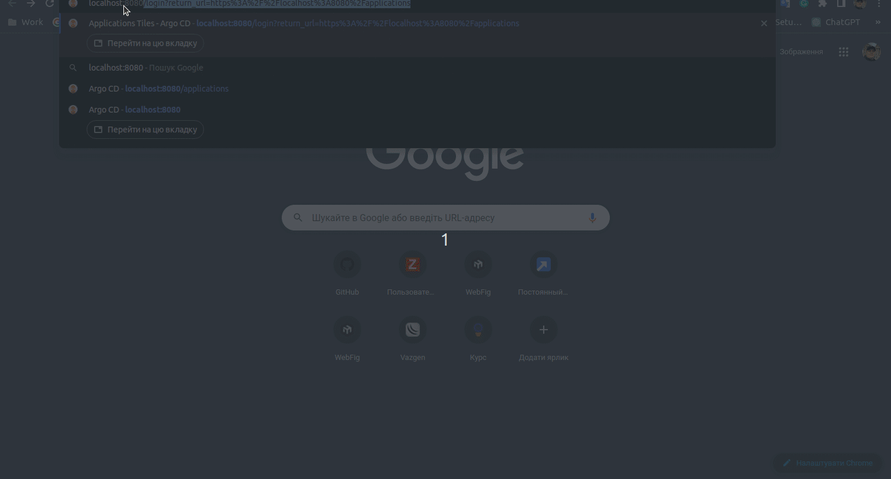

 1.  Виконайте команду `kubectl create namespace argocd` для створення нового простору імен (namespace) з назвою "argocd" в Kubernetes.
    
 2.  Застосуйте конфігураційний файл, розташований за посиланням `https://raw.githubusercontent.com/argoproj/argo-cd/stable/manifests/install.yaml`, до простору імен "argocd" за допомогою команди `kubectl apply -n argocd -f install.yaml`.

 3.   Для перенаправлення портів і отримання доступу до сервісу Argo CD через локальний порт 8080, виконайте команду `kubectl port-forward svc/argocd-server -n argocd 8080:443&`.
    
 4.  Завантажте виконуваний файл Argo CD для Linux за допомогою команди `curl -sSL -o argocd-linux-amd64 https://github.com/argoproj/argo-cd/releases/latest/download/argocd-linux-amd64`.
    
 5.  Встановіть завантажений файл Argo CD як виконуваний, скопіювавши його до системної директорії `/usr/local/bin` за допомогою команди `sudo install -m 555 argocd-linux-amd64 /usr/local/bin/argocd`.
    
 6.  Видаліть завантажений файл Argo CD, використовуючи команду `rm argocd-linux-amd64`.
    
 7.  Виконайте команду `argocd admin initial-password -n argocd`, щоб отримати початковий пароль для адміністратора Argo CD у просторі імен "argocd".

    

    

> Щоб отримати список розгорнутих деплойментів у просторі імен "argocd":
> `kubectl get deployments -n argocd`.
> 
> Щоб перевірити статус подів, які працюють у просторі імен "argocd":
> `kubectl get pods -n argocd`.
> 
> Щоб отримати список всіх подів у всіх просторах імен: `kubectl get
> pods --all-namespaces`.
> 
> Щоб отримати список вузлів, які приєднані до кластера Kubernetes у
> просторі імен "argocd": `kubectl get nodes -n argocd` .
> 
> Щоб отримати список сервісів, доступних у просторі імен "argocd":
> `kubectl get services -n argocd`.

    

